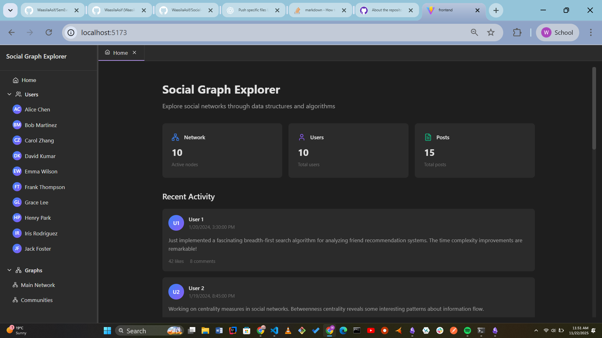
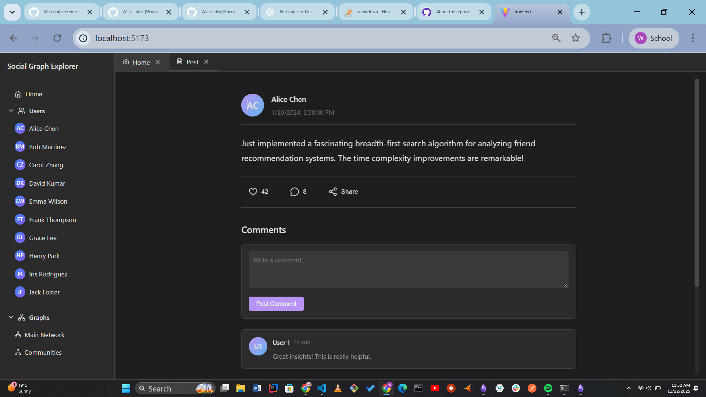
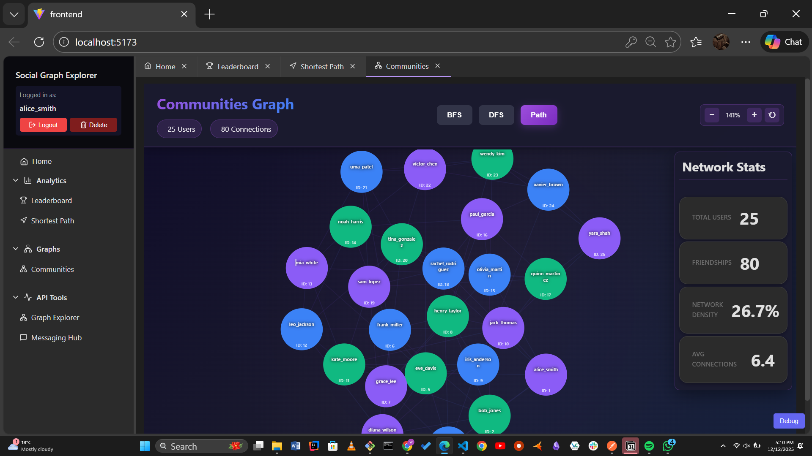
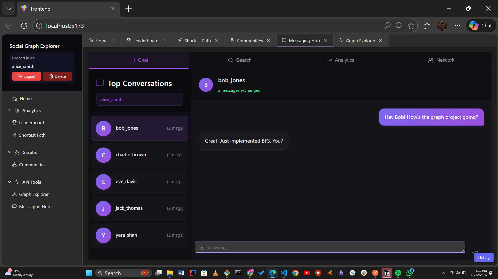
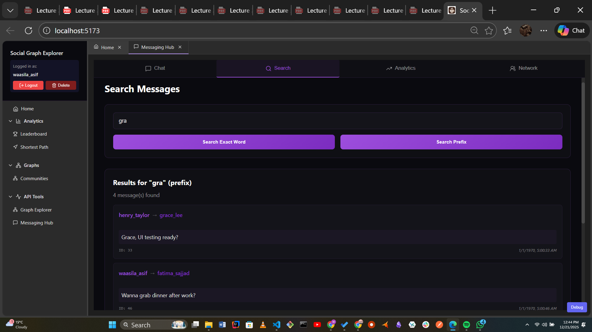
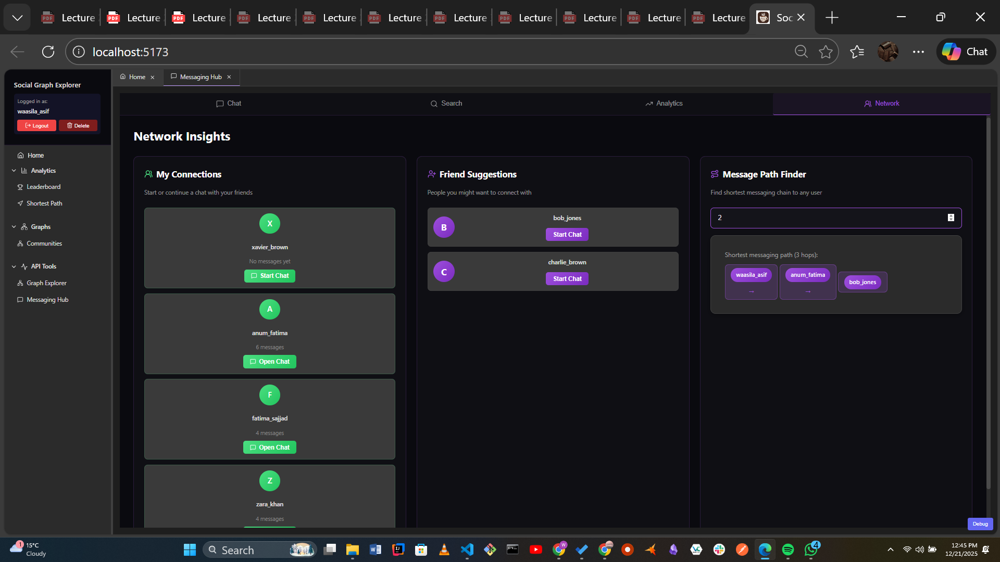
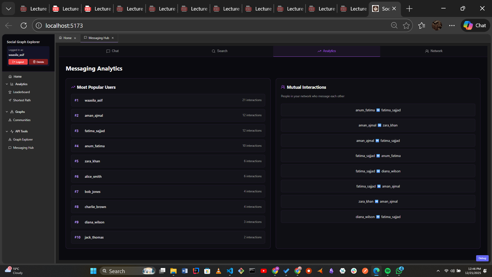

#  SocialGraphExplorer

A comprehensive **Social Network Backend & Frontend** application demonstrating advanced **Data Structures and Algorithms (DSA)** concepts. This project implements a mini Instagram-like social network with real-time graph operations, messaging systems, and analytics.









---

##  Table of Contents

1. [Project Overview](#project-overview)
2. [Key Features](#key-features)
3. [Technology Stack](#technology-stack)
4. [System Architecture](#system-architecture)
5. [Data Structures & Algorithms](#data-structures--algorithms)
6. [Quick Start Guide](#quick-start-guide)
7. [Complete API Reference](#complete-api-reference)
8. [Frontend Features](#frontend-features)
9. [Database Schema](#database-schema)
10. [Testing & Validation](#testing--validation)
11. [Project Structure](#project-structure)
12. [Team Contributions](#team-contributions)

---

##  Project Overview

### Problem Statement

Modern social networks require efficient handling of:
- **Dynamic social graphs** with users and friendships
- **Fast search** for users and friend suggestions
- **Real-time messaging** with search and analytics
- **Graph algorithms** for relationship analysis

### Objectives

| Objective | Description |
|-----------|-------------|
| **Educational** | Demonstrate mastery of advanced DSA concepts |
| **Functional** | Provide a working social network prototype |
| **Performance** | Implement efficient traversal, search, and ranking algorithms |
| **Modular** | Ensure each component is testable and reusable |

---

##  Key Features

### User Management
-  User registration and authentication
-  Profile management with posts
-  Trie-based username autocomplete search
-  Account deletion with cascade cleanup

### Social Graph
-  Add/Remove friendships (bidirectional)
-  BFS/DFS graph traversals
-  Shortest path between users
-  Network statistics and analytics

### Messaging System
-  Send/receive messages
-  Trie-based word and prefix search
-  Top-K conversation partners
-  Messaging-based friend suggestions
-  Shortest messaging path

### Analytics & Recommendations
-  Mutual friends calculation
-  Friend suggestions (2-hop algorithm)
-  Popularity ranking (PageRank-style)
-  Network metrics (density, diameter, clustering)

---

##  Technology Stack

### Backend
| Component | Technology | Version |
|-----------|------------|---------|
| Language | C++ | C++17 |
| Web Framework | Crow | Latest |
| Async I/O | ASIO | 1.30.2 |
| JSON | nlohmann/json | 3.11+ |
| Database | JSON Files | - |

### Frontend
| Component | Technology | Version |
|-----------|------------|---------|
| Framework | React | 19.2.0 |
| Language | TypeScript | 5.9.3 |
| Build Tool | Vite (Rolldown) | 7.2.5 |
| Routing | React Router | 7.9.6 |
| State Management | Zustand | 5.0.8 |
| Icons | Lucide React | 0.554.0 |
| Styling | Custom CSS | Obsidian Theme |

---

##  System Architecture

```
┌─────────────────────────────────────────────────────────────────┐
│                        FRONTEND (React)                          │
│  ┌──────────┐ ┌──────────┐ ┌──────────┐ ┌──────────────────────┐│
│  │ Dashboard│ │ GraphView│ │ Messaging│ │ UserProfile          ││
│  └────┬─────┘ └────┬─────┘ └────┬─────┘ └──────────┬───────────┘│
│       │            │            │                   │            │
│       └────────────┴────────────┴───────────────────┘            │
│                              │                                    │
│                    ┌─────────▼─────────┐                         │
│                    │   API Service     │                         │
│                    │  (api.ts)         │                         │
│                    └─────────┬─────────┘                         │
└──────────────────────────────┼───────────────────────────────────┘
                               │ HTTP REST
                               ▼
┌─────────────────────────────────────────────────────────────────┐
│                    BACKEND (C++ Crow Server)                     │
│                         Port 8081                                │
│  ┌────────────────────────────────────────────────────────────┐ │
│  │                     API Routes Layer                        │ │
│  │  ┌──────────┐ ┌──────────┐ ┌──────────┐ ┌──────────┐      │ │
│  │  │ userAPI  │ │ graphAPI │ │ msgAPI   │ │ algoAPI  │      │ │
│  │  └────┬─────┘ └────┬─────┘ └────┬─────┘ └────┬─────┘      │ │
│  └───────┼────────────┼────────────┼────────────┼─────────────┘ │
│          │            │            │            │               │
│  ┌───────▼────────────▼────────────▼────────────▼─────────────┐ │
│  │                  Business Logic Layer                       │ │
│  │  ┌───────────┐ ┌─────────┐ ┌────────────┐ ┌─────────────┐  │ │
│  │  │UserManager│ │  Graph  │ │MessageStore│ │ Algorithms  │  │ │
│  │  └─────┬─────┘ └────┬────┘ └─────┬──────┘ └──────┬──────┘  │ │
│  └────────┼────────────┼────────────┼───────────────┼──────────┘ │
│           │            │            │               │            │
│  ┌────────▼────────────▼────────────▼───────────────▼──────────┐ │
│  │               Data Structures Layer (Custom DSA)            │ │
│  │  ┌────────┐ ┌──────┐ ┌──────┐ ┌───────┐ ┌──────┐ ┌───────┐ │ │
│  │  │  Trie  │ │ Heap │ │Stack │ │HashMap│ │ AVL  │ │ Graph │ │ │
│  │  └────────┘ └──────┘ └──────┘ └───────┘ └──────┘ └───────┘ │ │
│  └─────────────────────────────────────────────────────────────┘ │
│                               │                                  │
│  ┌────────────────────────────▼────────────────────────────────┐ │
│  │                   Persistence Layer                          │ │
│  │  ┌───────────┐          ┌────────────┐                      │ │
│  │  │JSONLoader │ ◄──────► │ JSONWriter │                      │ │
│  │  └─────┬─────┘          └──────┬─────┘                      │ │
│  └────────┼───────────────────────┼─────────────────────────────┘ │
└───────────┼───────────────────────┼─────────────────────────────┘
            │                       │
            ▼                       ▼
    ┌───────────────────────────────────────┐
    │         JSON Database Files           │
    │  ┌─────────┐ ┌───────────┐ ┌────────┐│
    │  │users.json│ │friendships│ │messages││
    │  │(25 users)│ │(80 edges) │ │(64 msgs)││
    │  └─────────┘ └───────────┘ └────────┘│
    └───────────────────────────────────────┘
```

---

##  Data Structures & Algorithms

### Custom Implementations (No STL)

| Data Structure | File | Purpose |
|----------------|------|---------|
| **Trie** | `MsgTrie.cpp` | Message word search, username autocomplete |
| **Max Heap** | `MsgHeap.cpp` | Priority scheduling, Top-K queries |
| **Stack** | `MsgStack.cpp` | Undo functionality |
| **HashMap** | `HashMap.h` | User caching, fast lookups |
| **AVL Tree** | `AVLTree.h` | Balanced storage |
| **Graph** | `Graph.h` | Social network representation |
| **Dynamic Array** | `DynamicArray.h` | Posts, message storage |
| **Linked List** | `LinkedList.h` | Feed management |

### Graph Algorithms

| Algorithm | Purpose | Endpoint |
|-----------|---------|----------|
| **BFS** | Traversal, shortest path | `/graph/bfs/:start` |
| **DFS** | Traversal, connectivity | `/graph/dfs/:start` |
| **Dijkstra** | Weighted shortest path | `/api/algo/shortest-path` |
| **2-Hop BFS** | Friend suggestions | `/api/algo/friend-suggestions` |
| **Connected Components** | Network analysis | `/graph/components` |

### Analytics Algorithms

| Algorithm | Purpose |
|-----------|---------|
| **Mutual Friends** | Hash-set intersection |
| **Popularity Rank** | Max-heap extraction |
| **Network Density** | Edge/vertex ratio |
| **Clustering Coefficient** | Triangle counting |

---

##  Quick Start Guide

### Prerequisites

| Requirement | Version | Purpose |
|-------------|---------|---------|
| C++ Compiler | GCC 9.0+ / MSVC 2019+ | Backend compilation |
| Node.js | v18.0.0+ | Frontend runtime |
| npm | v9.0.0+ | Package management |
| Git | Latest | Version control |

### Step 1: Clone Repository

```bash
git clone https://github.com/your-repo/SocialGraphExplorer.git
cd SocialGraphExplorer
```

### Step 2: Backend Setup

#### Windows (PowerShell) - Recommended

```powershell
# Navigate to backend API folder
cd backend/api

# Compile the server (adjust paths to your VCPKG/ASIO installation)
C:\msys64\ucrt64\bin\g++.exe -std=c++17 `
  -I D:/Repos_Libs/VCPKG/vcpkg-master/installed/x64-windows/include `
  -I D:/Repos_Libs/asio-1.30.2/include `
  -I ../include -I ../libs -I .. `
  server.cpp routes/algoRoutes.cpp routes/graphRoutes.cpp routes/MsgAPI.cpp routes/MsgRoutes.cpp `
  ../dsa/user/User.cpp ../dsa/user/UserManager.cpp ../dsa/utils/idGenerator.cpp `
  ../dsa/messaging_ds/MsgTrie.cpp ../dsa/messaging_ds/MsgStack.cpp ../dsa/messaging_ds/MsgHeap.cpp `
  ../dsa/messaging_ds/ConversationGraph.cpp ../storage/JSONLoader.cpp ../storage/JSONWriter.cpp `
  ../algorithms/ShortestPath.cpp ../algorithms/MutualFriends.cpp ../algorithms/FriendSuggestion.cpp `
  ../analytics/PopularityRanker.cpp ../messaging/MessageStore.cpp ../messaging/MessageQueue.cpp `
  ../messaging/MessagingSystem.cpp ../messaging/UndoStack.cpp ../messaging/ScheduledMessages.cpp `
  ../messaging/MessageAnalytics.cpp ../messaging/TopKConversations.cpp `
  ../algorithms/MsgShortestPatch.cpp ../algorithms/MsgMutualInteractions.cpp `
  ../algorithms/MsgPopularityRanker.cpp ../algorithms/MsgFriendSuggestion.cpp `
  ../algorithms/MsgTopKMessage.cpp `
  -o server.exe -lws2_32 -lwsock32 -DASIO_STANDALONE

# Run the server
.\server.exe
```

#### MSYS2 UCRT64 Terminal (Alternative)

```bash
cd backend/api

g++ -std=c++17 \
  -I /d/VS_Crow/Crow/vcpkg/installed/x64-windows/include \
  -I ../include -I ../libs -I .. \
  server.cpp routes/*.cpp ../dsa/user/*.cpp ../dsa/utils/*.cpp \
  ../dsa/messaging_ds/*.cpp ../storage/*.cpp ../algorithms/*.cpp \
  ../analytics/*.cpp ../messaging/*.cpp \
  -o server.exe -lws2_32 -lwsock32 -DASIO_STANDALONE

./server.exe
```

#### Expected Output

```
Loaded 25 users from database.
Loading data from JSON files...
Loaded 80 friendships from storage/local_db/friendships.json
Loaded 64 messages from storage/local_db/messages.json
Data loaded successfully!

========================================
 Social Network Graph API Server
 Listening on: http://localhost:8081
 Graph routes registered
 Messaging routes registered
 User routes registered
 Server ready!
========================================
```
### Step 3: Run the proxy server
As the CORS was not being implemented up to the mark we applied the strategy of implementing the proxy server in js that acts as the the middle man between the frontend and the backend

*From the root directory*
```
cd backend; node cors-proxy.js
```

### Step 4: Frontend Setup

```powershell
# Open new terminal
cd frontend

# Install dependencies, only needed once
npm install

# Start development server
npm run dev
```

Frontend will be available at: **http://localhost:5173**

### Step 4: Verify Installation

```bash
# Test health endpoint
curl http://localhost:8081/health

# Test user API
curl http://localhost:8081/api/users/1

# Test graph API
curl http://localhost:8081/graph/friends/1

# Test messaging API
curl http://localhost:8081/msg/search/hello
```

---

##  Complete API Reference

**Base URL:** `http://localhost:8081`

### Health Check

| Method | Endpoint | Description |
|--------|----------|-------------|
| GET | `/health` | Server health check |

---

###  User Management APIs (8 Endpoints)

| Method | Endpoint | Body | Description |
|--------|----------|------|-------------|
| POST | `/api/users/register` | `{username, password}` | Register new user |
| POST | `/api/users/login` | `{username, password}` | User login |
| GET | `/api/users/search?prefix=X` | - | Search users by prefix (Trie) |
| GET | `/api/users/:id` | - | Get user by ID |
| DELETE | `/api/users/:id` | - | Delete user account |
| POST | `/api/users/:id/posts` | `{content}` | Create post |
| GET | `/api/users/:id/posts` | - | Get user posts |
| DELETE | `/api/users/:id/posts/:index` | - | Delete post |

#### Example: User Registration
```bash
curl -X POST http://localhost:8081/api/users/register \
  -H "Content-Type: application/json" \
  -d '{"username":"alice","password":"pass123"}'
```

**Response:**
```json
{
  "success": true,
  "message": "User registered successfully",
  "userId": 321
}
```

---

###  Graph Operations APIs (9 Endpoints)

| Method | Endpoint | Body | Description |
|--------|----------|------|-------------|
| GET | `/graph/friends/:id` | - | Get user's friends |
| POST | `/graph/addFriend` | `{u, v}` | Add friendship (bidirectional) |
| POST | `/graph/removeFriend` | `{u, v}` | Remove friendship |
| GET | `/graph/stats` | - | Get graph statistics |
| GET | `/graph/connected/:u/:v` | - | Check if users connected |
| GET | `/graph/components` | - | Get connected components count |
| GET | `/graph/bfs/:start` | - | BFS traversal from user |
| GET | `/graph/dfs/:start` | - | DFS traversal from user |
| GET | `/graph/shortest-path/:src/:dest` | - | Shortest path between users |

#### Example: Add Friendship
```bash
curl -X POST http://localhost:8081/graph/addFriend \
  -H "Content-Type: application/json" \
  -d '{"u":1,"v":2}'
```

**Response:**
```json
{
  "success": true,
  "message": "Friendship added between 1 and 2"
}
```


```bash
curl http://localhost:8081/graph/stats
```

**Response:**
```json
{
  "nodeCount": 25,
  "edgeCount": 61,
  "averageDegree": 2.1,
  "density": 0.0012,
  "connected": false,
  "components": 45,
  "diameter": 8
}
```

---

###  Messaging System APIs (8 Endpoints)

| Method | Endpoint | Body | Description |
|--------|----------|------|-------------|
| POST | `/msg/send` | `{senderId, receiverId, text}` | Send message |
| GET | `/msg/search/:word` | - | Search by exact word (Trie) |
| GET | `/msg/prefix/:prefix` | - | Search by word prefix (Trie) |
| GET | `/msg/topk/:userId/:k` | - | Top K conversation partners |
| GET | `/msg/suggestions/:userId/:k` | - | Friend suggestions from messages |
| GET | `/msg/mutual/:userId` | - | Mutual interactions |
| GET | `/msg/rank/:topN` | - | Popularity ranking |
| GET | `/msg/path/:src/:dest` | - | Shortest messaging path |

#### Example: Send Message
```bash
curl -X POST http://localhost:8081/msg/send \
  -H "Content-Type: application/json" \
  -d '{"senderId":1,"receiverId":2,"text":"Hello, how are you?"}'
```

**Response:**
```json
{
  "status": "success",
  "messageId": 52
}
```

#### Example: Search Messages by Prefix
```bash
curl http://localhost:8081/msg/prefix/proj
```

**Response:**
```json
{
  "results": [1, 5, 12, 23, 34, 42],
  "count": 6
}
```

---

###  Algorithm APIs (10 Endpoints)

| Method | Endpoint | Description | Algorithm |
|--------|----------|-------------|-----------|
| GET | `/api/algo/mutual-friends?user1=X&user2=Y` | Find common friends | Hash-set intersection |
| GET | `/api/algo/shortest-path?start=X&end=Y` | Shortest connection path | BFS |
| GET | `/api/algo/users-within-distance?userId=X&distance=N` | Users N hops away | BFS |
| GET | `/api/algo/user-degree?userId=X` | Get friend count | Adjacency list |
| GET | `/api/algo/user-rank?userId=X` | Get popularity rank | Max-heap |
| GET | `/api/algo/graph-stats` | Network statistics | Graph analysis |
| GET | `/api/algo/top-popular?n=X` | Top N popular users | Max-heap |
| GET | `/api/algo/two-hop-friends?userId=X` | Friends of friends | 2-hop BFS |
| GET | `/api/algo/friend-suggestions?userId=X&limit=N` | AI friend suggestions | Mutual friends + frequency |

#### Example: Mutual Friends
```bash
curl "http://localhost:8081/api/algo/mutual-friends?user1=1&user2=5"
```

**Response:**
```json
{
  "user1": 1,
  "user2": 5,
  "mutualFriends": [2, 3, 7],
  "count": 3
}
```

#### Example: Friend Suggestions
```bash
curl "http://localhost:8081/api/algo/friend-suggestions?userId=1&limit=5"
```

**Response:**
```json
{
  "userId": 1,
  "suggestions": [
    {"userId": 15, "mutualFriends": 5, "score": 8.5},
    {"userId": 22, "mutualFriends": 3, "score": 6.2}
  ],
  "count": 2
}
```

---

### Response Format

**Success Response:**
```json
{
  "success": true,
  "data": {...}
}
```

**Error Response:**
```json
{
  "success": false,
  "error": "Error message description"
}
```

### HTTP Status Codes

| Code | Meaning |
|------|---------|
| 200 | OK (successful GET) |
| 201 | Created (successful POST) |
| 400 | Bad Request |
| 401 | Unauthorized |
| 404 | Not Found |
| 500 | Internal Server Error |

---

## Frontend Features

### Pages & Components

| Page | Description | Key Features |
|------|-------------|--------------|
| **Dashboard** | User home page | Stats, friends, posts, suggestions |
| **Graph View** | Network visualization | BFS/DFS traversal, node selection |
| **Messaging Hub** | Chat interface | Real-time messaging, search, analytics |
| **User Profile** | Profile view | Connect button, posts, friends list |
| **Login/Register** | Authentication | Form validation, localStorage |

### UI Features

-  **Dark Obsidian Theme** - Professional dark mode design
-  **Responsive Layout** - Works on all screen sizes
-  **Toast Notifications** - Success/error feedback
-  **Loading States** - Smooth UX with spinners
-  **Real-time Search** - Trie-based autocomplete

### State Management

- **localStorage** - User session persistence
- **Zustand** - Global state management
- **React Context** - Theme and auth context

---

##  Database Schema

### users.json
```json
{
  "users": [
    {
      "id": 1,
      "username": "alice_smith",
      "password": "pass123",
      "posts": ["First post!", "Hello world!"]
    }
  ]
}
```

### friendships.json
```json
{
  "friendships": [
    {"u": 1, "v": 2},
    {"u": 1, "v": 3}
  ]
}
```

### messages.json
```json
{
  "messages": [
    {
      "id": 1,
      "receiverId": 2,
      "senderId": 1,
      "text": "Hey Bob! How's the graph project going?",
      "timestamp": 1
    }
  ]
}
```

### Current Database Stats

| Entity | Count |
|--------|-------|
| Users | 25 |
| Friendships | 80 |
| Messages | 64 |

---

##  Testing & Validation

Units tests were done for each module and program being made side by side.

### API Testing with Postman

Import the included Postman collection:
```
SocialGraphExplorer.postman_collection.json
```

---

##  Project Structure

```
SocialGraphExplorer/
├── backend/
│   ├── api/
│   │   ├── server.cpp              # Main Crow server (port 8081)
│   │   └── routes/                 # Messaging, Algorithm, User and Graph Endpoints
│   ├── dsa/
│   │   ├── containers/             # LinkedList, Stack, Queue, HashMap, Trie
│   │   ├── graph/                  # Graph, Node, Edge
│   │   ├── messaging_ds/           # MsgTrie, MsgHeap, MsgStack
│   │   ├── user/                   # User, UserManager
│   │   └── utils/                  # IDGenerator, Errors
│   ├── algorithms/                 # BFS, DFS, ShortestPath, etc.
│   ├── messaging/                  # MessagingSystem, MessageStore
│   ├── storage/
│   │   ├── JSONLoader.cpp
│   │   ├── JSONWriter.cpp
│   │   └── local_db/               # JSON database files
│   └── tests/                      # 79+ unit tests
├── frontend/
│   ├── src/
│   │   ├── components/             # React components
│   │   ├── pages/                  # Page components
│   │   ├── services/               # API service (api.ts)
│   │   └── styles/                 # CSS files
│   ├── package.json
│   └── vite.config.ts
├── README.md                       # This file

```

---

##  Team Contributions

| Member | Responsibilities |
|--------|-----------------|
| **Anum** | Hashmaps, DynamicArray, Trie, Id Generator, User specific details and apis |
| **Aman** | LinkedList , Stack, Queue, BFS, DFS, Graph related details handling and apis |
| **Fatima** | Priority Queues , Algorithms: Shortest Path, Popularity Ranker, Mutual Friends, and their routes, Frontend polish |
| **Waasila** | Messaging System (Utilizes Queue & Stack) Msg Trie for fast prefix-based search, Msg Heap (Top-K conversation ranking) with implemented algorithms for message insertion, search, ranking, ordering, and mutual-friend chat suggestions. Server INtegration and frontend |


##  Troubleshooting

### Common Issues

**Port already in use:**
```powershell
taskkill /F /IM server.exe
```

**CORS errors:**
- Ensure backend CORS headers are configured
- Check frontend API_BASE_URL is correct (port 8081)

**Compilation errors:**
- Verify ASIO and Crow paths are correct
- Ensure C++17 flag is set

**Frontend not connecting:**
```bash
# Verify backend is running
curl http://localhost:8081/health
```

##  License

This project is developed for educational purposes as part of a Data Structures & Algorithms course. For CS 14 B Nust 

---

<div align="center">

**Built with ❤️ using C++, React, and Custom DSA Implementations**

*SocialGraphExplorer - Demonstrating DSA in Real-World Applications*

</div>
